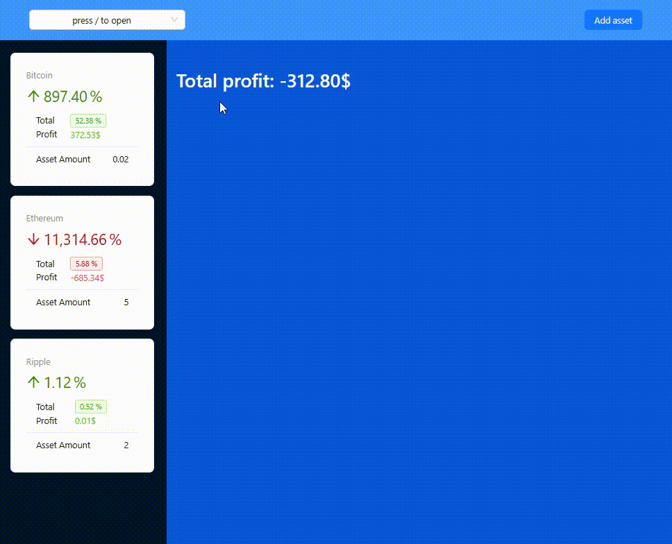

# Hi there, I am Maryna Shavlak 👋
- 🌱 I’m currently learning TypeScript.

👩‍💼 **Frontend Developer | UI/UX Enthusiast**: Passionate about crafting visually stunning and intuitive user interfaces using HTML, CSS, JavaScript, and React. 🚀 
👩‍💻 **Scientific Approach to Coding**: With a background in science, I bring a systematic and logical approach to coding challenges, coupled with excellent problem-solving skills. My ability to quickly grasp and apply new concepts makes me an adaptable force in the frontend development field. 🧠💻 
📠**Grant Recipient - IT Generation Program**: Demonstrated capability as a Front End Developer by securing a grant for the IT Generation program. Proficient in leveraging technical skills alongside soft skills for impactful results. 🆠
🌟**Collaborator**: Excited about collaborating with fellow developers and designers to create compelling digital experiences. Let's turn ideas into reality! 🌐✨ 
## 🤝 Connect with me:

   
💬 If you have any question/feedback, please do not hesitate to reach out to me!

## 💼 Technical Skills

<table style="width: 100%; border-collapse: collapse; margin: 20px 0;">
  <thead>
    <tr style="background-color: #f2f2f2;">
      <th style="width: 33%; padding: 10px; border: 1px solid #ddd;">🧱 Core Technologies</th>
      <th style="width: 33%; padding: 10px; border: 1px solid #ddd;">⚛️ Frontend Frameworks & Libraries</th>
      <th style="width: 33%; padding: 10px; border: 1px solid #ddd;">🗃️ State Management</th>
    </tr>
  </thead>
  <tbody>
    <tr>
      <td style="padding: 10px; border: 1px solid #ddd;">
        
        
        
      </td>
      <td style="padding: 10px; border: 1px solid #ddd;">
        
        
      </td>
      <td style="padding: 10px; border: 1px solid #ddd;">
        
        
        
        
        
        
      </td>
    </tr>
    <tr style="background-color: #f2f2f2;">
      <th style="padding: 10px; border: 1px solid #ddd;">🎨 Styling & UI Libraries</th>
      <th style="padding: 10px; border: 1px solid #ddd;">🧰 Build Tools & Dev Environment</th>
      <th style="padding: 10px; border: 1px solid #ddd;">🔧 Code Quality & Linting</th>
    </tr>
    <tr>
      <td style="padding: 10px; border: 1px solid #ddd;">
        
        
        
        
        
        
        
      </td>
      <td style="padding: 10px; border: 1px solid #ddd;">
        
        
        
        
        
        
        
        
        
      </td>
      <td style="padding: 10px; border: 1px solid #ddd;">
        
        
        
      </td>
    </tr>
    <tr style="background-color: #f2f2f2;">
      <th style="padding: 10px; border: 1px solid #ddd;">🌐 Routing & Navigation</th>
      <th style="padding: 10px; border: 1px solid #ddd;">✅ Form Handling & Validation</th>
      <th style="padding: 10px; border: 1px solid #ddd;">🛠️ Utility Libraries</th>
    </tr>
    <tr>
      <td style="padding: 10px; border: 1px solid #ddd;">
        
      </td>
      <td style="padding: 10px; border: 1px solid #ddd;">
        
        
        
        
        
        
      </td>
      <td style="padding: 10px; border: 1px solid #ddd;">
        
        
        
        
        
        
        
        
      </td>
    </tr>
    <tr style="background-color: #f2f2f2;">
      <th style="padding: 10px; border: 1px solid #ddd;">📦 Package Managers</th>
      <th style="padding: 10px; border: 1px solid #ddd;">🧪 Testing & QA</th>
      <th style="padding: 10px; border: 1px solid #ddd;">🎬 Animations & Transitions</th>
    </tr>
    <tr>
      <td style="padding: 10px; border: 1px solid #ddd;">
        
      </td>
      <td style="padding: 10px; border: 1px solid #ddd;">
        
        
        
        
        
        
      </td>
      <td style="padding: 10px; border: 1px solid #ddd;">
        
        
        
        
        
        
        
        
      </td>
    </tr>
    <tr style="background-color: #f2f2f2;">
      <th style="padding: 10px; border: 1px solid #ddd;">🧩 Component Libraries</th>
      <th style="padding: 10px; border: 1px solid #ddd;">🧑‍💻 Design & Prototyping</th>
      <th style="padding: 10px; border: 1px solid #ddd;">🌐 API Development</th>
    </tr>
    <tr>
      <td style="padding: 10px; border: 1px solid #ddd;">
        
        
        
        
        
        
        
        
        
      </td>
      <td style="padding: 10px; border: 1px solid #ddd;">
        
        
      </td>
      <td style="padding: 10px; border: 1px solid #ddd;">
        
        
        
        
        
        
        
      </td>
    </tr>
    <tr style="background-color: #f2f2f2;">
      <th style="padding: 10px; border: 1px solid #ddd;">🚀 Deployment & Version Control</th>
      <th style="padding: 10px; border: 1px solid #ddd;">📅 Date & Time Handling</th>
      <th style="padding: 10px; border: 1px solid #ddd;">📝 Text & Content Editing</th>
    </tr>
    <tr>
      <td style="padding: 10px; border: 1px solid #ddd;">
        
        
        
        
        
      </td>
      <td style="padding: 10px; border: 1px solid #ddd;">
        
        
        
        
        
      </td>
      <td style="padding: 10px; border: 1px solid #ddd;">
        
        
        
      </td>
    </tr>
    <tr style="background-color: #f2f2f2;">
      <th style="padding: 10px; border: 1px solid #ddd;">🔍 Search & Filtering</th>
      <th style="padding: 10px; border: 1px solid #ddd;">📊 Data Visualization & Tables</th>
      <th style="padding: 10px; border: 1px solid #ddd;">🔄 Drag & Drop</th>
    </tr>
    <tr>
      <td style="padding: 10px; border: 1px solid #ddd;">
        
        
      </td>
      <td style="padding: 10px; border: 1px solid #ddd;">
        
        
        
        
        
      </td>
      <td style="padding: 10px; border: 1px solid #ddd;">
        
      </td>
    </tr>
    <tr style="background-color: #f2f2f2;">
      <th style="padding: 10px; border: 1px solid #ddd;">🔄 Carousels & Layouts</th>
      <th style="padding: 10px; border: 1px solid #ddd;">⏳ Loading Indicators</th>
      <th style="padding: 10px; border: 1px solid #ddd;">📄 Pagination & Load More</th>
    </tr>
    <tr>
      <td style="padding: 10px; border: 1px solid #ddd;">
        
        
        
        
        
      </td>
      <td style="padding: 10px; border: 1px solid #ddd;">
        
      </td>
      <td style="padding: 10px; border: 1px solid #ddd;">
        
        
        
      </td>
    </tr>
    <tr style="background-color: #f2f2f2;">
      <th style="padding: 10px; border: 1px solid #ddd;">🔔 Modals & Notifications</th>
      <th style="padding: 10px; border: 1px solid #ddd;">🧰 Tweaks UI</th>
      <th style="padding: 10px; border: 1px solid #ddd;">👥 Accessibility & Device Detection</th>
    </tr>
    <tr>
      <td style="padding: 10px; border: 1px solid #ddd;">
        
        
        
        
        
      </td>
      <td style="padding: 10px; border: 1px solid #ddd;">
        
        
        
        
        
        
      </td>
      <td style="padding: 10px; border: 1px solid #ddd;">
        
        
      </td>
    </tr>
    <tr style="background-color: #f2f2f2;">
      <th style="padding: 10px; border: 1px solid #ddd;">🔄 Progressive Web Apps</th>
      <th style="padding: 10px; border: 1px solid #ddd;">📁 File Manipulation & Code Generation</th>
      <th style="padding: 10px; border: 1px solid #ddd;">✉️ Email & Media</th>
    </tr>
    <tr>
      <td style="padding: 10px; border: 1px solid #ddd;">
        
        
        
      </td>
      <td style="padding: 10px; border: 1px solid #ddd;">
        
        
        
        
      </td>
      <td style="padding: 10px; border: 1px solid #ddd;">
        
        
        
      </td>
    </tr>
    <tr style="background-color: #f2f2f2;">
      <th style="padding:

## 🔗 Links to My Project Repositories: 
### Individual:
<table>
  <tr>
    <td><a href="https://github.com/MarynaShavlak/dev-interview-hub" target="_blank">Dev Interview Hub</a> (React, Typescript, Werbpack, Vite, AST)</td>
    <td><a href="https://github.com/MarynaShavlak/phonebook" target="_blank">Phonebook</a> (React)</td>
    
  </tr>
  <tr>
    <td></td>
    <td></td>
    
  </tr>
  <tr>
    <td><a href="https://github.com/MarynaShavlak/tetromino" target="_blank">Tetromino Web Game</a> (JavaScript, Canvas)</td>
    <td><a href="https://github.com/MarynaShavlak/daniela-4-years-game" target="_blank">Happy Birthday Riddle Quest</a> (React, TypeScript)</td>
    
  </tr>
  <tr>
    <td></td>
    <td></td>
    
  </tr>
<tr>
    <td><a href="https://github.com/MarynaShavlak/eslint-plugin-toggle-features" target="_blank">ESLint Plugin Toggle Features</a> (JavaScript, AST, ESLint Plugin)</td>
    <td><a href="https://github.com/MarynaShavlak/eslint-plugin-path-supervisor" target="_blank">ESLint Plugin Path Supervisor</a> (JavaScript, AST, ESLint Plugin</td>
    
  </tr>
  <tr>
    <td></td>
    <td></td>
    
  </tr>

  
  <tr>
   <td><a href="https://github.com/MarynaShavlak/movie-finder" target="_blank">Movie Finder</a> (React)</td>
    <td><a href="https://github.com/MarynaShavlak/comfort-group-cleaning" target="_blank">Cleaning Company</a> (JavaScript, jQuery, Gulp)</td>
  </tr>
  <tr>
    <td></td>
    <td></td>
  </tr>
  <tr>
    <td><a href="https://github.com/MarynaShavlak/game-sudoku-for-kids" target="_blank">Sudoku for Kids Web Game</a> (JavaScript)</td>
    <td><a href="https://github.com/MarynaShavlak/web-studio" target="_blank">Web Studio</a> (HTML, SASS)</td>
  </tr>
  <tr>
    <td></td>
    <td></td>
  </tr>
  <tr>
    <td><a href="https://github.com/MarynaShavlak/calculator" target="_blank">Calculator UA</a> (JavaScript)</td>
     <td><a href="https://github.com/MarynaShavlak/nanogram-xpert" target="_blank">NanogramXpert Game</a> (JavaScript, Canvas)</td>
  </tr>
  <tr>
    <td></td>
     <td></td>
  </tr>
  <tr>
    <td><a href="https://github.com/MarynaShavlak/rock-paper-scissors" target="_blank">Rock-Paper-Scissors Web Game</a> (JavaScript)</td>
    <td><a href="https://github.com/MarynaShavlak/game-invaders" target="_blank">Invaders Web Game</a> (JavaScript)</td>
  </tr>
  <tr>
    <td></td>
    <td></td>
  </tr>
  <tr>
    <td><a href="https://github.com/MarynaShavlak/game-roulette" target="_blank">Lucky Roulette Web Game</a> (JavaScript)</td>
    <td><a href="https://github.com/MarynaShavlak/matching-game" target="_blank">Matching Web Game</a> (JavaScript)</td>
  </tr>
  <tr>
    <td></td>
    <td></td>
  </tr>
  <tr>
    <td><a href="https://github.com/MarynaShavlak/react-image-finder" target="_blank">Image Finder</a> (React)</td>
    <td><a href="https://github.com/MarynaShavlak/mortgage-loan-calculator" target="_blank">Mortgage Loan Calculator</a> (JavaScript)</td>
    
  </tr>
  <tr>
    <td></td>
    <td></td>
    </tr>
    <tr>
    <td><a href="https://github.com/MarynaShavlak/countries-hub" target="_blank">Countries Hub</a> (React, Typesript)</td>
     <td><a href="https://github.com/MarynaShavlak/crypto" target="_blank">Crypto Web App</a> (React, Vite)</td>
  </tr>
  <tr>
    <td></td>
     <td></td>
  </tr>
 <tr>
    <td><a href="https://github.com/MarynaShavlak/shopping-list-ts" target="_blank">Shopping List</a> (React, Typesript, Canvas)</td>
    <td><a href="https://github.com/MarynaShavlak/code-meter" target="_blank">Code Meter</a> (JavaScript, Canvas)</td>
  </tr>
  <tr>
    <td></td>
     <td></td>
  </tr>
  <tr>
    <td><a href="https://github.com/MarynaShavlak/jt-types-conversations-quiz" target="_blank">JavaScript Quiz</a> (jQuery)</td>
    <td><a href="https://github.com/MarynaShavlak/kharkiv-slider" target="_blank">Explore Kharkiv</a> (jQuery)</td>
  </tr>
  <tr>
    <td></td>
     <td></td>
  </tr>
  <tr>
    <td><a href="https://github.com/MarynaShavlak/registration-form-validation" target="_blank">Registration Form Validation</a> (JavaScript)</td>
    <td><a href="https://github.com/MarynaShavlak/car-landing" target="_blank">Car Landing Page</a> (jQuery)</td>
  </tr>
  <tr>
    <td></td>
     <td></td>
  </tr>
   <tr>
    <td><a href="https://github.com/MarynaShavlak/bhagaskara-landing" target="_blank">Bhagaskara Landing Page</a> (jQuery, Canvas)</td>
    <td></td>
  </tr>
  <tr>
   <td></td>
     <td></td>
  </tr>
</table>

  

### Collaborative:
<table>
  <tr>
    <td><a href="https://github.com/SvitlanaHonchar/Goose-Track_Work-Smart" target="_blank">Goose Track</a> (React, Webpack)</td>
    <td><a href="https://github.com/MarynaShavlak/filmoteka" target="_blank">Filmoteka</a> (JavaScript, Parcel)</td>
  </tr>
  <tr>
    <td></td>
    <td></td>
  </tr>
  <tr>
    <td><a href="https://github.com/AnnaKilchytska/team-work-smart-not-hard" target="_blank">Ice Cream</a> (HTML, CSS, SASS)</td>
    <td></td>
  </tr>
  <tr>
    <td></td>
    <td></td>
  </tr>
</table>

## 💼 Technical Skills

### 🧱 Core Technologies  
  
  
  

### ⚛️ Frontend Frameworks & Libraries  
  
  

### 🗃️ State Management  
  
  
  
  
  

### 🎨 Styling & UI Libraries  
  
  
  
  
  
  

### 🧰 Build Tools & Dev Environment  
  
  
  
  
  
  
  

### 🔧 Code Quality & Linting  
  
  
  

### 🌐 Routing & Navigation  
  

### ✅ Form Handling & Validation  
  
  
  
  
  
  

### 🛠️ Utility Libraries  
  
  
  
  
  
  
  

### 📦 Package Managers  
  

### 🧪 Testing & QA  
  
  
  
  
  

### 🎬 Animations & Transitions  
  
  
  
  

### 🧩 Component Libraries  
  
  
  
  
  
  

### 🧑‍💻 Design & Prototyping  
  

### 🌐 API Development  
  
  
  
  

### 🚀 Deployment & Version Control  
  
  
  

