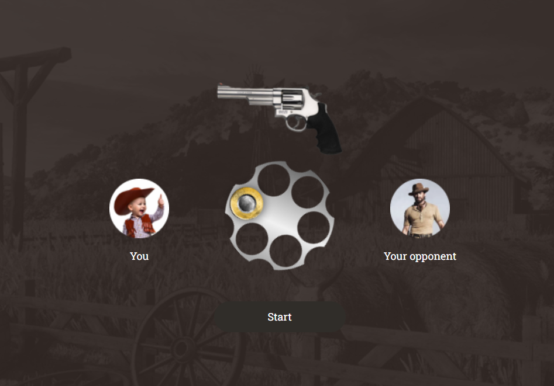

# Hi there, I am Maryna Shavlak 👋
- 🌱 I’m currently learning TypeScript.

👩‍💼 **Frontend Developer | UI/UX Enthusiast**: Passionate about crafting visually stunning and intuitive user interfaces using HTML, CSS, JavaScript, and React. 🚀 
👩‍💻 **Scientific Approach to Coding**: With a background in science, I bring a systematic and logical approach to coding challenges, coupled with excellent problem-solving skills. My ability to quickly grasp and apply new concepts makes me an adaptable force in the frontend development field. 🧠💻 
🎓 **Grant Recipient - IT Generation Program**: Demonstrated capability as a Front End Developer by securing a grant for the IT Generation program. Proficient in leveraging technical skills alongside soft skills for impactful results. 🏆 
🌟**Collaborator**: Excited about collaborating with fellow developers and designers to create compelling digital experiences. Let's turn ideas into reality! 🌐✨ 
## 🤝 Connect with me:

   
💬 If you have any question/feedback, please do not hesitate to reach out to me!

## 🔗 Links to My Project Repositories: 
### Individual:
<table>
  <tr>
    <td><a href="https://github.com/MarynaShavlak/dev-interview-hub" target="_blank">Dev Interview Hub</a> (React, Typescript)</td>
    <td><a href="https://github.com/MarynaShavlak/phonebook" target="_blank">Phonebook</a> (React)</td>
    
  </tr>
  <tr>
    <td></td>
    <td></td>
    
  </tr>
  <tr>
    <td><a href="https://github.com/MarynaShavlak/tetromino" target="_blank">Tetromino Web Game</a> (JavaScript, Canvas)</td>
    <td><a href="https://github.com/MarynaShavlak/daniela-4-years-game" target="_blank">Happy Birthday Riddle Quest</a> (React, TypeScript)</td>
    
  </tr>
  <tr>
    <td></td>
    <td></td>
    
  </tr>
<tr>
    <td><a href="https://github.com/MarynaShavlak/eslint-plugin-toggle-features" target="_blank">ESLint Plugin Toggle Features</a> (JavaScript, AST, ESLint Plugin)</td>
    <td><a href="https://github.com/MarynaShavlak/eslint-plugin-path-supervisor" target="_blank">ESLint Plugin Path Supervisor</a> (JavaScript, AST, ESLint Plugin</td>
    
  </tr>
  <tr>
    <td></td>
    <td></td>
    
  </tr>

  
  <tr>
   <td><a href="https://github.com/MarynaShavlak/movie-finder" target="_blank">Movie Finder</a> (React)</td>
    <td><a href="https://github.com/MarynaShavlak/comfort-group-cleaning" target="_blank">Cleaning Company</a> (JavaScript, jQuery, Gulp)</td>
  </tr>
  <tr>
    <td></td>
    <td></td>
  </tr>
  <tr>
    <td><a href="https://github.com/MarynaShavlak/game-sudoku-for-kids" target="_blank">Sudoku for Kids Web Game</a> (JavaScript)</td>
    <td><a href="https://github.com/MarynaShavlak/web-studio" target="_blank">Web Studio</a> (HTML, SASS)</td>
  </tr>
  <tr>
    <td></td>
    <td></td>
  </tr>
  <tr>
    <td><a href="https://github.com/MarynaShavlak/calculator" target="_blank">Calculator UA</a> (JavaScript)</td>
    <td><a href="https://github.com/MarynaShavlak/tetris-js" target="_blank">Tetris Web Game</a> (JavaScript) - in progress</td>
  </tr>
  <tr>
    <td></td>
    <td></td>
  </tr>
  <tr>
    <td><a href="https://github.com/MarynaShavlak/rock-paper-scissors" target="_blank">Rock-Paper-Scissors Web Game</a> (JavaScript)</td>
    <td><a href="https://github.com/MarynaShavlak/game-invaders" target="_blank">Invaders Web Game</a> (JavaScript)</td>
  </tr>
  <tr>
    <td></td>
    <td></td>
  </tr>
  <tr>
    <td><a href="https://github.com/MarynaShavlak/game-roulette" target="_blank">Lucky Roulette Web Game</a> (JavaScript)</td>
    <td><a href="https://github.com/MarynaShavlak/matching-game" target="_blank">Matching Web Game</a> (JavaScript)</td>
  </tr>
  <tr>
    <td></td>
    <td></td>
  </tr>
  <tr>
    <td><a href="https://github.com/MarynaShavlak/react-image-finder" target="_blank">Image Finder</a> (React)</td>
    <td><a href="https://github.com/MarynaShavlak/mortgage-loan-calculator" target="_blank">Mortgage Loan Calculator</a> (JavaScript)</td>
    
  </tr>
  <tr>
    <td></td>
    <td></td>
    </tr>
    <tr>
    <td><a href="https://github.com/MarynaShavlak/countries-hub" target="_blank">Countries Hub</a> (React, Typesript)</td>
     <td><a href="https://github.com/MarynaShavlak/crypto" target="_blank">Crypto Web App</a> (React, Vite)</td>
  </tr>
  <tr>
    <td></td>
     <td></td>
  </tr>
 <tr>
    <td><a href="https://github.com/MarynaShavlak/shopping-list-ts" target="_blank">Shopping List</a> (React, Typesript, Canvas)</td>
    <td><a href="https://github.com/MarynaShavlak/code-meter" target="_blank">Code Meter</a> (JavaScript, Canvas)</td>
  </tr>
  <tr>
    <td></td>
     <td></td>
  </tr>
  <tr>
    <td><a href="https://github.com/MarynaShavlak/jt-types-conversations-quiz" target="_blank">JavaScript Quiz</a> (jQuery)</td>
    <td><a href="https://marynashavlak.github.io/kharkiv-slider/" target="_blank">Explore Kharkiv</a> (jQuery)</td>
  </tr>
  <tr>
    <td></td>
     <td></td>
  </tr>
  <tr>
    <td><a href="https://github.com/MarynaShavlak/registration-form-validation" target="_blank">Registration Form Validation</a> (JavaScript)</td>
    <td><a href="https://github.com/MarynaShavlak/car-landing" target="_blank">Car Landing Page</a> (jQuery)</td>
  </tr>
  <tr>
    <td></td>
     <td></td>
  </tr>
   <tr>
    <td><a href="[https://github.com/MarynaShavlak/car-landing](https://github.com/MarynaShavlak/bhagaskara-landing)" target="_blank">Bhagaskara Landing Page</a> (jQuery, Canvas)</td>
    <td><a href="https://github.com/MarynaShavlak/nanogram-xpert" target="_blank">NanogramXpert Game</a> (JavaScript, Canvas)</td>
  </tr>
  <tr>
   <td></td>
     <td></td>
  </tr>
</table>

  

### Collaborative:
<table>
  <tr>
    <td><a href="https://github.com/SvitlanaHonchar/Goose-Track_Work-Smart" target="_blank">Goose Track</a> (React, Webpack)</td>
    <td><a href="https://github.com/MarynaShavlak/filmoteka" target="_blank">Filmoteka</a> (JavaScript, Parcel)</td>
  </tr>
  <tr>
    <td></td>
    <td></td>
  </tr>
  <tr>
    <td><a href="https://github.com/AnnaKilchytska/team-work-smart-not-hard" target="_blank">Ice Cream</a> (HTML, CSS, SASS)</td>
    <td></td>
  </tr>
  <tr>
    <td></td>
    <td></td>
  </tr>
</table>

## 💼 Technical Skills
**Core Technologies** 

 
**JavaScript Frameworks** 

 
**JavaScript Libraries** 

 
**Styling Tools** 

 
**Build Tools** 

 
**Methodologies** 

 
**Package Managers** 

 
**Design Tools** 

 
**API Development** 

 
**Deployment and Version Control** 

